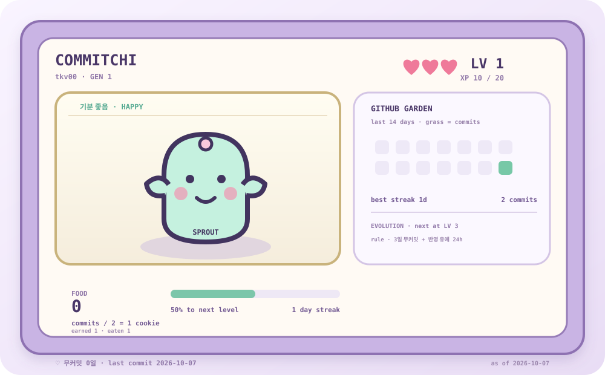

# 커밋치 · COMMITCHI



GitHub에 커밋하면 먹이를 얻고 자라는 README 다마고치입니다. README 안에서는 상태 이미지를 보고, 돌봄은 GitHub Actions가 자동으로 처리합니다. 별도 서버나 AI API는 필요하지 않습니다.

## 키우는 법

| 행동 | 결과 |
|---|---|
| GitHub가 인정한 커밋 기여 2개 | 먹이 1개. 남는 커밋 1개는 다음 계산으로 이월 |
| 매일 자동 급식 | 하루 최대 3개를 먹고, 남은 먹이는 보관 |
| 먹이 1개 섭취 | 경험치 +10 |
| 누적 경험치 20 / 60 / 300 / 900 | 레벨 2 / 3 / 6 / 10 |
| 레벨 3 / 6 / 10 | 아기 → 성장체 → 왕관으로 외형 변화 |
| 커밋이 없는 하루가 끝남 | 연속 활동이 끊기고 체력이 줄어듦 |
| 3일 연속 무커밋 | 위험 상태. GitHub 반영 지연을 고려해 하루 더 유예 |
| 유예까지 포함해 4일이 연속으로 끝남 | 사망. 저장된 먹이가 있어도 활동 중단 사망은 막지 못함 |
| 사망 뒤 새 커밋 | 다음 세대로 부화. 레벨·먹이·홀수 이월분 초기화, 전체 기록 유지 |

먹이가 0개여도 방금 먹은 상태일 수 있습니다. `earned`는 얻은 먹이, `eaten`은 먹은 먹이, 큰 숫자는 남은 먹이입니다. 경험치와 레벨은 현재 세대 기준이고 전체 커밋·얻은 먹이·먹은 먹이는 모든 세대 누적입니다.

처음 정상 갱신한 날부터 키웁니다. 과거 전체 커밋을 소급해 먹이로 바꾸지는 않습니다. 시작한 날의 커밋 기여는 포함합니다.

### 사망 시점 예시

10월 7일에 마지막으로 커밋했다면 8·9·10일 무커밋 후 위험 상태가 되고, 11일은 유예입니다. 11일까지 커밋 없이 끝나면 12일의 다음 정상 갱신에서 사망합니다. 11일에 새 커밋이 확인되면 같은 세대를 계속 키웁니다. 당일은 끝나기 전까지 무커밋 하루로 세지 않습니다.

## 집계 기준

- 기본은 **공개 저장소의 커밋 기여**입니다. PR·이슈·리뷰 등 다른 잔디 활동은 먹이로 계산하지 않습니다.
- 이 프로필 저장소 `tkv00/tkv00`는 집계에서 제외합니다. README 자동 커밋으로 먹이가 늘어나는 것을 막습니다.
- 날짜는 GitHub 일별 기여 API의 `occurredAt`에서 얻은 날짜 버킷을 사용합니다. 게임의 날짜 진행은 UTC이며 한국 시간 오전 9시에 다음 날짜가 됩니다. 각 커밋을 KST 시각으로 다시 분류한 통계는 아닙니다.
- GitHub 기여 조건에 맞는 커밋만 잡힙니다. author 이메일, 기본 브랜치, fork 여부 등의 조건과 GitHub 반영 지연이 적용됩니다.
- 최근 7일을 다시 조회합니다. 이미 얻은 커밋 수는 같은 날짜의 최댓값으로 유지해 재실행·일시적 감소로 먹이가 줄거나 늘지 않게 합니다.
- API 실패, 잘못된 응답, 페이지 누락, 합계 불일치가 있으면 갱신을 중단하고 기존 파일을 유지합니다. 오류를 0커밋으로 취급하지 않습니다.
- 뒤늦게 반영된 커밋은 기록을 다시 계산하므로 잘못 판정된 사망이 정정될 수 있습니다.

공개되는 데이터는 날짜별 커밋 수와 펫 상태뿐입니다. 토큰이나 비공개 저장소 이름·내용은 상태 파일에 저장하지 않습니다.

## 자동 갱신

[Readme & Commitchi](https://github.com/tkv00/tkv00/actions/workflows/main.yml)가 약 4시간마다 실행됩니다. GitHub 예약 실행은 지연될 수 있으며 README 이미지 캐시 때문에 화면 반영도 늦을 수 있습니다. Actions의 **Run workflow**로 직접 갱신할 수 있습니다.

워크플로는 테스트 후 커밋을 조회하고 `pet/data/ledger.json`, `pet/data/state.json`, `assets/commitchi.svg`를 한 Git 커밋으로 저장합니다. 기존 블로그 글 갱신도 유지하며 RSS가 일시적으로 실패해도 펫 갱신은 별도로 저장합니다. PR에서는 테스트만 수행합니다.

저장소에 동시에 다른 push가 들어와 자동 push가 거절되면 강제로 덮어쓰지 않습니다. 다음 실행에서 최신 기록을 읽어 다시 계산합니다. 장기간 사용하지 않은 공개 저장소는 GitHub가 예약 실행을 비활성화할 수 있습니다.

### 비공개 커밋도 반영하고 싶다면

기본 설치에는 별도 토큰이 필요하지 않습니다. 개인 토큰을 사용하려면 저장소 secret `PET_GITHUB_TOKEN`을 별도로 설정할 수 있습니다. 비공개 기여 조회에는 적절한 사용자 권한이 필요하고 실제 토큰 범위에 따라 결과가 달라집니다. 사용자 토큰을 공개 파일에 넣지 마세요.

`PET_INCLUDE_PRIVATE=true`로 전환하려면 집계 기준 자체가 달라집니다. 현재 구현은 기존 펫의 기준이 조용히 바뀌지 않도록 중단합니다. 전환 전 원래 기록을 보관하고 새 집계 기준으로 시작할지 결정해야 합니다. 비공개 모드는 현재 프로필의 기본 구성으로 검증한 범위에 포함되지 않습니다.

## 로컬 확인

```sh
npm test
npm run pet:preview
```

`http://127.0.0.1:8769/pet/preview.html`에서 현재 이미지와 상태별 데모를 봅니다. 데모 버튼은 실제 펫 상태를 바꾸지 않습니다.

`PET_GITHUB_TOKEN` 환경 변수를 안전하게 설정한 뒤 `npm run pet:update`로 실제 커밋을 조회할 수 있습니다. Node.js 24 이상을 권장합니다. 새 라이브러리는 추가하지 않았습니다.

## 근거 문서

- [GitHub 커밋 기여 기준과 날짜](https://docs.github.com/en/account-and-profile/reference/profile-contributions-reference)
- [기여 반영 지연](https://docs.github.com/en/account-and-profile/how-tos/contribution-settings/troubleshooting-missing-contributions)
- [GraphQL 기여 조회](https://docs.github.com/en/graphql/reference/users#contributionscollection)
- [GitHub Actions 예약 실행](https://docs.github.com/en/actions/reference/workflows-and-actions/events-that-trigger-workflows#schedule)

README의 핵심 화면은 외부 폰트·스크립트가 없는 SVG입니다. README에서 JavaScript 게임을 실행하는 방식이 아니며, 먹이·성장·사망 계산은 워크플로가 담당합니다.
